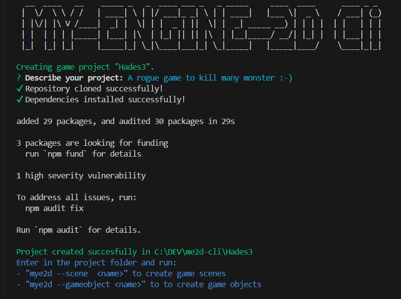

# mye2d companion tool

`mye2D` is the companion cli to speed up the use of my mini game engine [my-engine-2d](https://github.com/LorenzoCorbella74/my-engine-2d).




## Install
```bash
> npm install -g mye2D
```


## Features
As of 07/2024 it's possible to
- [x] create project with `mye2D --new <project_name>`
- [x] create gAME scenes `mye2D --scene <scene_name>`
- [x] create game objects `mye2D  --gameobject <name> <scene_name>`

## Todos
- [ ] "common" game object (not related to specific scenes)
- [ ] other file templates (TBD...)


# Bugs
- uhm, let me know...